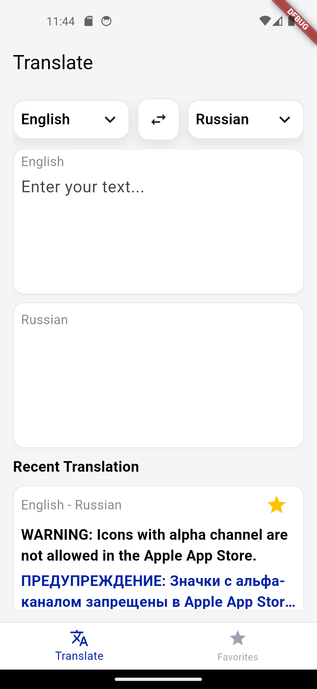
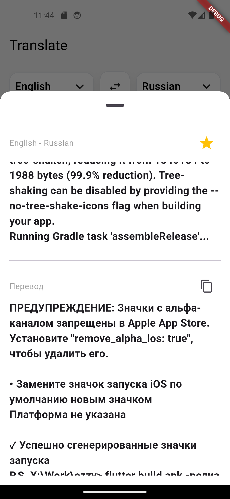
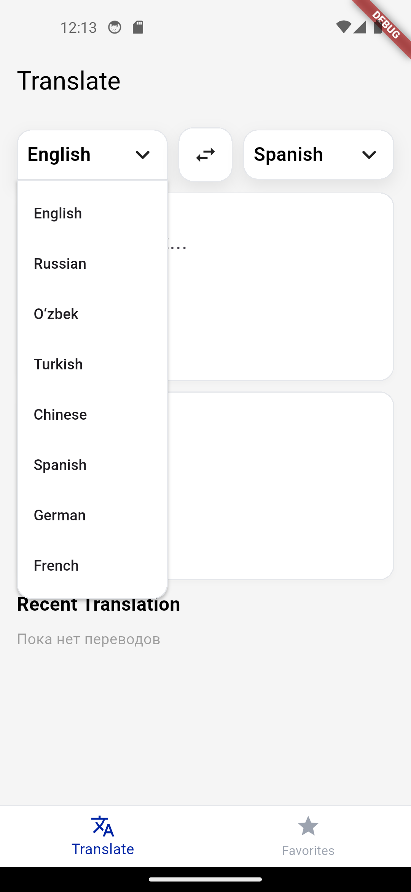
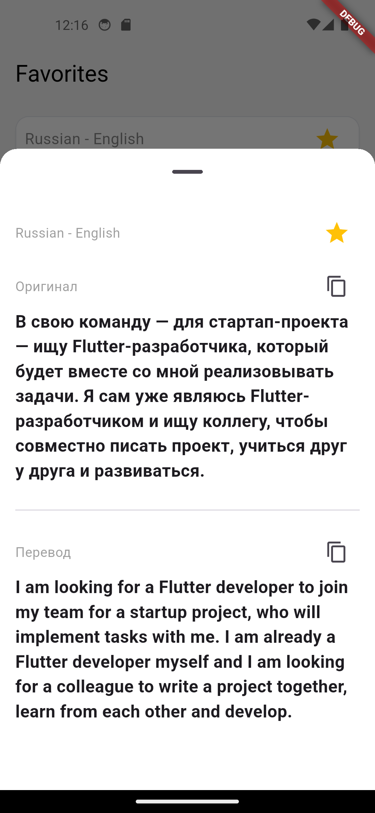
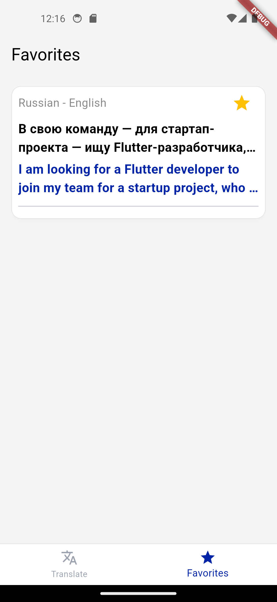

# Ezzy Translate

Flutter translator app using Yandex Cloud Translate API.  
Stores recent translations and favorites locally with Hive.

---

## Features

- Language selection (From / To)
- Swap languages button
- Auto-translate with debounce
- Translation result card
- Recent translations (max 3, smart update logic)
- Favorites (star system)
- Star synchronization between Recent and Favorites
- Translation detail bottom sheet:
  - Separate sections: Original / Translation
  - Copy buttons
  - Star toggle
- Local persistence (Hive)

---

## Screenshots

<!-- Row 1 -->

  
  
  

  <b>Screenshot 1</b>
  <b>Screenshot 2</b>
  <b>Screenshot 3</b>

 

<!-- Row 2 -->

  
  

  <b>Screenshot 4</b>
  <b>Screenshot 5</b>

